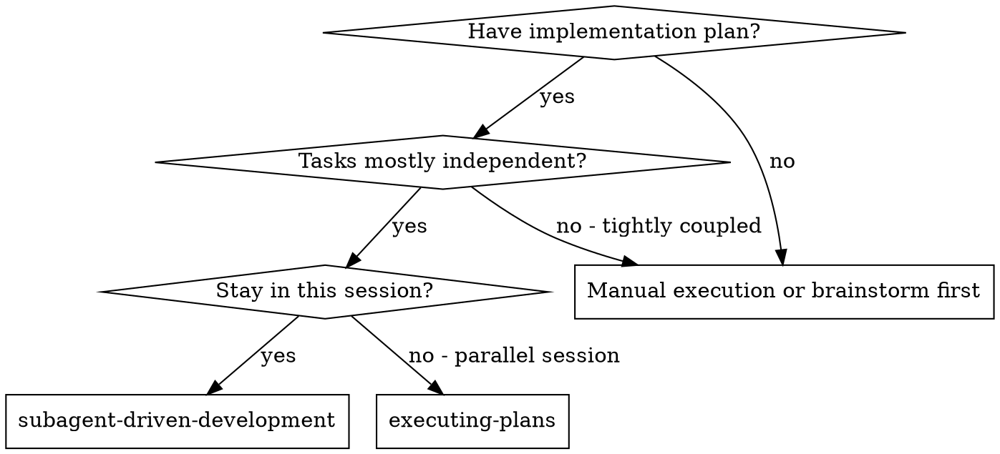
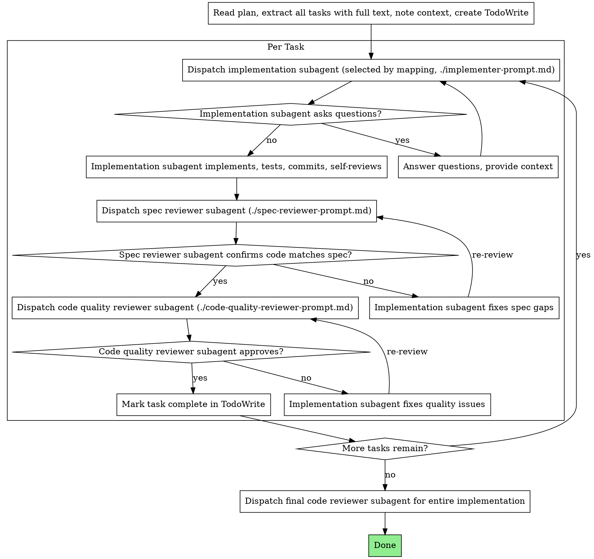

# Subagent-Driven Development

Execute plan by dispatching fresh subagent per task, with two-stage review after each: spec compliance review first, then code quality review.

**Core principle:** Fresh subagent per task + two-stage review (spec then quality) = high quality, fast iteration

## When to Use



**vs. Executing Plans (parallel session):**
- Same session (no context switch)
- Fresh subagent per task (no context pollution)
- Two-stage review after each task: spec compliance first, then code quality
- Faster iteration (no human-in-loop between tasks)

## The Process



## Prompt Templates

- `./implementer-prompt.md` - Dispatch implementation subagent (selected subagent_type)
- `./spec-reviewer-prompt.md` - Dispatch spec compliance reviewer subagent
- `./code-quality-reviewer-prompt.md` - Dispatch code quality reviewer subagent

## Implementer Dispatch Mapping

Before dispatching an implementation subagent, choose `subagent_type` from the mapping below.

Selection rules:
1. Build the available droid list from `~/.factory/droids` (filenames without `.md`).
2. If the task includes explicit tags like `[frontend]` or `type:frontend`, use that category.
3. Otherwise match keywords (most specific match wins).
4. If the chosen droid is missing, fall back to `general-purpose`.
5. Do not use review-only droids (e.g., `code-reviewer`) for implementation tasks.

Keyword mapping (examples; extend as needed):

```
frontend-developer: [react, next, ui, component, hook, hooks, tsx, tailwind, shadcn]
ui-ux-designer: [design, wireframe, mockup, ux, user-flow]
ui-visual-validator: [visual, screenshot, pixel, a11y, regression]
backend-specialist: [api, rest, graphql, auth, service, microservice]
fastapi-pro: [fastapi, pydantic, starlette]
django-pro: [django, drf, channels, celery]
python-pro: [python, asyncio, pip, venv]
javascript-pro: [javascript, node, npm, promises]
typescript-pro: [typescript, ts, tsconfig, types]
java-pro: [java, spring, jvm]
golang-pro: [go, golang, goroutine]
rust-pro: [rust, cargo, lifetimes]
cpp-specialist: [c++, cpp, cmake]
csharp-pro: [c#, dotnet, asp.net]
php-pro: [php, laravel]
ruby-pro: [ruby, rails]
scala-pro: [scala, akka, zio]
elixir-pro: [elixir, phoenix, otp]
flutter-expert: [flutter, dart]
wordpress-developer: [wordpress, wp, plugin, theme]
database-specialist: [database, schema, migration, index, postgres, mysql]
sql-pro: [sql, query, join, cte]
data-specialist: [etl, pipeline, warehouse, analytics]
mlops-engineer: [mlops, training, model-deploy, mlflow]
ai-engineer: [llm, rag, embeddings, vector, prompt-pipeline]
prompt-engineer: [prompt, system-prompt, eval, jailbreak]
security-specialist: [security, owasp, vuln, encryption]
devops-specialist: [ci, cd, docker, terraform, pipeline]
kubernetes-architect: [k8s, kubernetes, helm, argo]
hybrid-cloud-architect: [multi-cloud, aws, azure, gcp, hybrid]
network-engineer: [vpc, dns, tls, routing, cdn]
observability-engineer: [logging, tracing, metrics, slo, sli]
incident-responder: [incident, outage, oncall, pagerduty]
test-automator: [test, e2e, unit, coverage, qa]
debugger: [bug, crash, stacktrace, failure]
legacy-modernizer: [legacy, migration, modernization, upgrade]
seo-specialist: [seo, sitemap, meta]
payment-integration: [stripe, paypal, checkout, billing]
mermaid-expert: [mermaid, diagram, flowchart]
documentation-specialist: [docs, documentation, api-doc]
dx-optimizer: [dx, tooling, dev-experience]
architect-review: [architecture, design-review]
search-specialist: [research, web-search, competitive]
blockchain-developer: [web3, solidity, smart-contract]
business-analyst: [kpi, metrics, roadmap, analysis]
context-manager: [context, memory, summarization]
orchestrator: [coordination, delegate, multi-agent]
general-purpose: []
```

## Example Workflow

```
You: I'm using Subagent-Driven Development to execute this plan.

[Read plan file once: docs/plans/feature-plan.md]
[Extract all 5 tasks with full text and context]
[Create TodoWrite with all tasks]

Task 1: Hook installation script

[Get Task 1 text and context (already extracted)]
[Dispatch implementation subagent (selected by mapping) with full task text + context]

Implementer: "Before I begin - should the hook be installed at user or system level?"

You: "User level (~/.config/superpowers/hooks/)"

Implementer: "Got it. Implementing now..."
[Later] Implementer:
  - Implemented install-hook command
  - Added tests, 5/5 passing
  - Self-review: Found I missed --force flag, added it
  - Committed

[Dispatch spec compliance reviewer]
Spec reviewer: ✅ Spec compliant - all requirements met, nothing extra

[Get git SHAs, dispatch code quality reviewer]
Code reviewer: Strengths: Good test coverage, clean. Issues: None. Approved.

[Mark Task 1 complete]

Task 2: Recovery modes

[Get Task 2 text and context (already extracted)]
[Dispatch implementation subagent (selected by mapping) with full task text + context]

Implementer: [No questions, proceeds]
Implementer:
  - Added verify/repair modes
  - 8/8 tests passing
  - Self-review: All good
  - Committed

[Dispatch spec compliance reviewer]
Spec reviewer: ❌ Issues:
  - Missing: Progress reporting (spec says "report every 100 items")
  - Extra: Added --json flag (not requested)

[Implementer fixes issues]
Implementer: Removed --json flag, added progress reporting

[Spec reviewer reviews again]
Spec reviewer: ✅ Spec compliant now

[Dispatch code quality reviewer]
Code reviewer: Strengths: Solid. Issues (Important): Magic number (100)

[Implementer fixes]
Implementer: Extracted PROGRESS_INTERVAL constant

[Code reviewer reviews again]
Code reviewer: ✅ Approved

[Mark Task 2 complete]

...

[After all tasks]
[Dispatch final code-reviewer]
Final reviewer: All requirements met, ready to merge

Done!
```

## Advantages

**vs. Manual execution:**
- Subagents follow TDD naturally
- Fresh context per task (no confusion)
- Parallel-safe (subagents don't interfere)
- Subagent can ask questions (before AND during work)

**vs. Executing Plans:**
- Same session (no handoff)
- Continuous progress (no waiting)
- Review checkpoints automatic

**Efficiency gains:**
- No file reading overhead (controller provides full text)
- Controller curates exactly what context is needed
- Subagent gets complete information upfront
- Questions surfaced before work begins (not after)

**Quality gates:**
- Self-review catches issues before handoff
- Two-stage review: spec compliance, then code quality
- Review loops ensure fixes actually work
- Spec compliance prevents over/under-building
- Code quality ensures implementation is well-built

**Cost:**
- More subagent invocations (implementer + 2 reviewers per task)
- Controller does more prep work (extracting all tasks upfront)
- Review loops add iterations
- But catches issues early (cheaper than debugging later)

## Red Flags

**Never:**
- Skip reviews (spec compliance OR code quality)
- Proceed with unfixed issues
- Dispatch multiple implementation subagents in parallel (conflicts)
- Make subagent read plan file (provide full text instead)
- Skip scene-setting context (subagent needs to understand where task fits)
- Ignore subagent questions (answer before letting them proceed)
- Accept "close enough" on spec compliance (spec reviewer found issues = not done)
- Skip review loops (reviewer found issues = implementer fixes = review again)
- Let implementer self-review replace actual review (both are needed)
- **Start code quality review before spec compliance is ✅** (wrong order)
- Move to next task while either review has open issues

**If subagent asks questions:**
- Answer clearly and completely
- Provide additional context if needed
- Don't rush them into implementation

**If reviewer finds issues:**
- Implementer (same subagent) fixes them
- Reviewer reviews again
- Repeat until approved
- Don't skip the re-review

**If subagent fails task:**
- Re-select a valid `subagent_type` from the available list
- Dispatch fix subagent with specific instructions
- Don't try to fix manually (context pollution)

## Integration

**Required workflow skills:**
- **writing-plans** - Creates the plan this skill executes
- **requesting-code-review** - Code review template for reviewer subagents

**Subagents should use:**
- **test-driven-development** - Subagents follow TDD for each task

**Alternative workflow:**
- **executing-plans** - Use for parallel session instead of same-session execution
